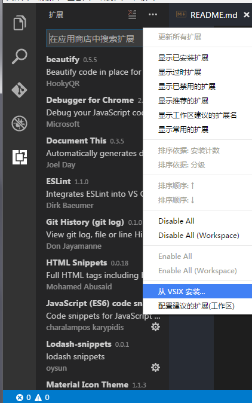

# Lodash README
Lodash工具库是我开发必不可少的，但是在vscode插件市场上找不到使用称心的Lodash snippets，所以就自己写一个。

# 安装 

* [vscode插件地址](https://marketplace.visualstudio.com/items?itemName=oysun.Lodash)
```javascript
ext install Lodash
```
* 如果网络不好可以用下载里面的.vsix文件本地安装



# 支持的文件格式
- javascript
- coffeescrip
- typescript
- javascriptreac
- vue

# 使用
输入"_"符号就会提示lodash所有的的函数


# 源码
[github](https://github.com/OYsun/Vscode-Lodash-Snippents)